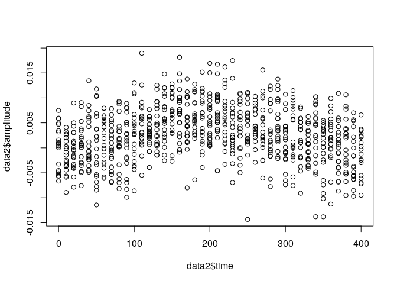
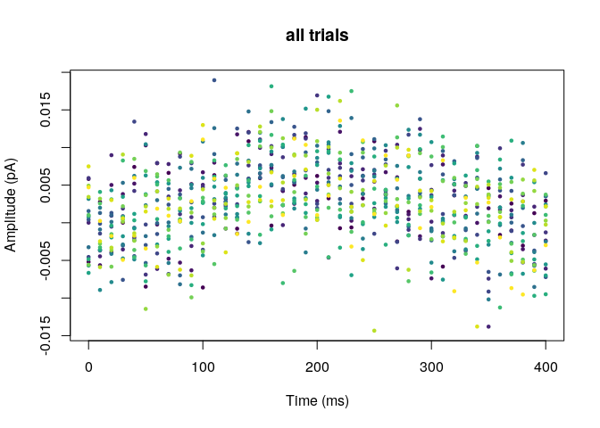
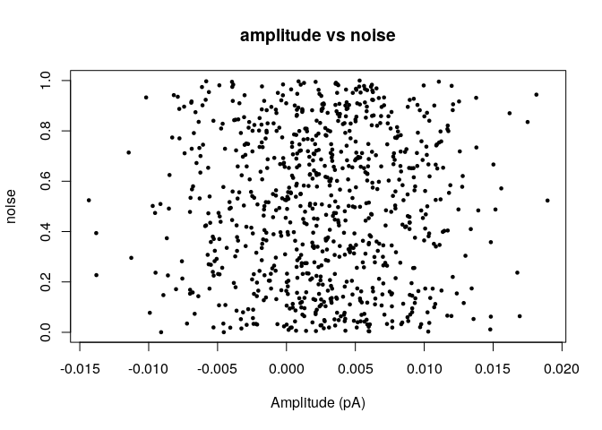
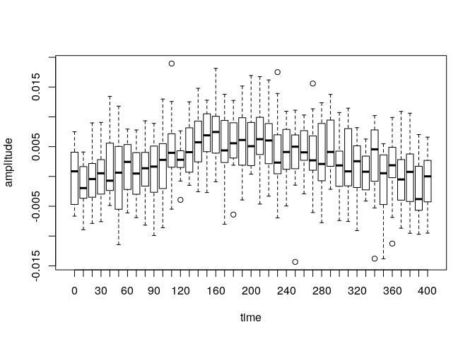
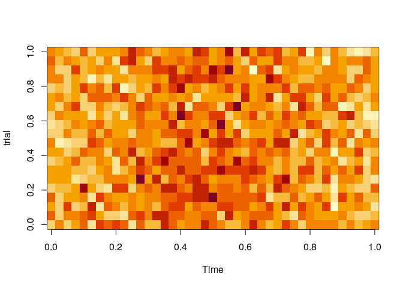
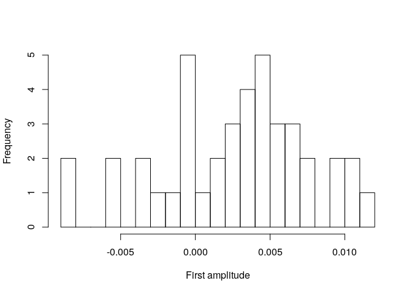
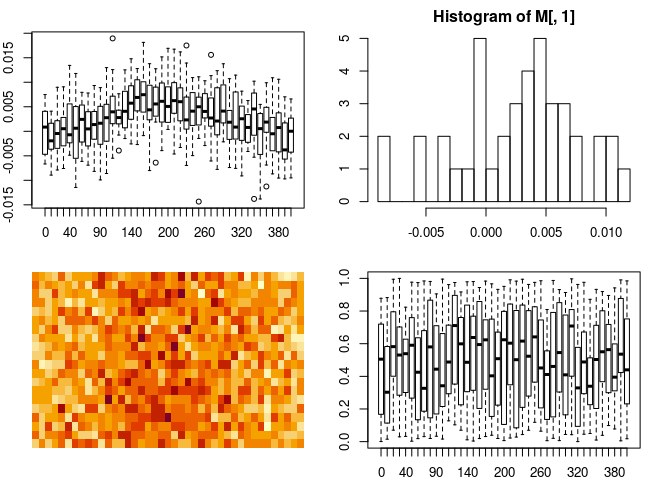
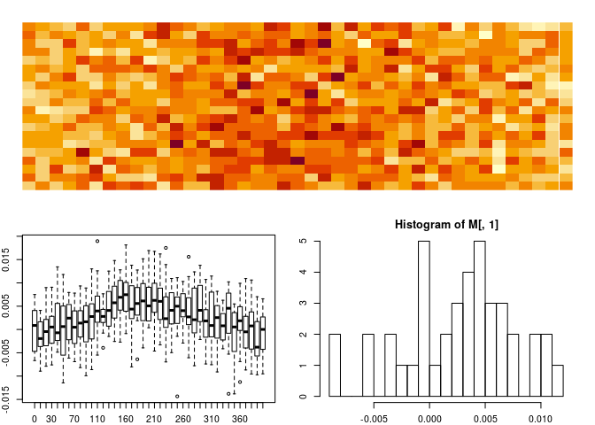

Introduction to R
================
Giovanni Diana
14 Oct, 2020

Getting started
===============

What is R?
----------

-   Computing language for data analysis
-   Compact, fast, modular and easy to learn
-   Compatible with all data formats
    -   excel spreadsheets
    -   text/csv
    -   matlab objects
    -   numpy objects
    -   image data (TIFF, etc.)
-   Huge R community

What is R studio?
-----------------

-   Integrated Development Environment for R
-   Everything connected to the same R environment
    -   Data analysis
    -   Notebooks
    -   Presentations

Data visualization
------------------

Besides the built-in graphics tools, there are several libraries developed for data visualization and interactive plots/apps

-   [ggplot2](https://ggplot2.tidyverse.org/)
-   [shiny](https://shiny.rstudio.com/)
-   [plotly](https://plotly.com/graphing-libraries/)

Notebooks
---------

-   [R Markdown](https://rmarkdown.rstudio.com/)
-   [IRkernel](https://irkernel.github.io/) on `jupyter notebook`

Data structures
===============

Numbers and vectors
-------------------

### Defining vectors

Vectors of fixed type (numeric or character) are define using the function "c(...)"

``` r
X = c("a",2,"xyz")        # vector of character types
```

There are also a number of alternative ways to generate numerical vectors:

``` r
X = 1:10                 # integer range between 1 to 10
X = seq(0,1.5,length=20)  # sequence of 20 values between 0 and 1.5
X = rep(10,4)             # repeat 10, 4 times
X = runif(n=5)            # 5 random numbers between 0 and 1
```

### Arithmetics

R supports vectorization of all arithmetic operations

``` r
X^2+2
```

    ## [1] 2.132038 2.191141 2.147308 2.014014 2.605411

Logical type
------------

Boolean 0 and 1 are denoted in R by `TRUE` and `FALSE`.

Logical vectors are generated by conditions such as

``` r
X;X>0.5
```

    ## [1] 0.3633704 0.4371964 0.3838073 0.1183821 0.7780819

    ## [1] FALSE FALSE FALSE FALSE  TRUE

### AND and OR operators

in R, & and | are the logical operators of AND and OR. Can be used to combine multiple constraints

``` r
X[X>0 & X<0.99]
```

    ## [1] 0.3633704 0.4371964 0.3838073 0.1183821 0.7780819

Subsetting vectors
------------------

We can subset vectors using logical vectors of the same dimension of the original vector

``` r
selection = X>0.5
X[selection]
```

    ## [1] 0.7780819

or by providing a vector of indices

``` r
indexes = c(1,4,3)
X[indexes]
```

    ## [1] 0.3633704 0.1183821 0.3838073

we can also extract the indices in a vector satisfying a constraint by using the function `which`

``` r
which(X>0.5)
```

    ## [1] 5

we can exclude elements from a vector by using negative indices

``` r
X[-c(1,2)]
```

    ## [1] 0.3838073 0.1183821 0.7780819

Arrays
------

### Matrix

In R, we can define 2-dimensional arrays as

``` r
X = runif(12)
M = matrix(data=X,nrow=3,ncol=4); M
```

    ##           [,1]       [,2]      [,3]         [,4]
    ## [1,] 0.3273485 0.89282428 0.8527464 0.0004268154
    ## [2,] 0.6927987 0.18454719 0.9594236 0.3784365989
    ## [3,] 0.3720714 0.02428222 0.8318757 0.4244392610

the data X is a 1-d vector which is reshaped into 3x4 matrix form in a "column major" fashion, i.e.

``` r
matrix(1:12,3,4)
```

    ##      [,1] [,2] [,3] [,4]
    ## [1,]    1    4    7   10
    ## [2,]    2    5    8   11
    ## [3,]    3    6    9   12

### Multidimensional arrays

Multi dimensional arrays are defined using the `array` function

``` r
A = array(runif(12), dim = c(2,3,2)); A # example of a 3D array (cube)
```

    ## , , 1
    ## 
    ##           [,1]      [,2]       [,3]
    ## [1,] 0.9078462 0.8354797 0.62378766
    ## [2,] 0.8342842 0.3799295 0.01264043
    ## 
    ## , , 2
    ## 
    ##           [,1]      [,2]      [,3]
    ## [1,] 0.5081761 0.4985849 0.4993783
    ## [2,] 0.5848022 0.7348524 0.3815116

### Subsetting arrays

We can access array elements by providing as many indices as dimensions

``` r
A[1,1,2]
```

    ## [1] 0.5081761

and we can subset arrays as we did for vectors

``` r
A[,2:3,] # Note the commas! Unlike python we don't need to esplicitely type ":" when selecting all elements
```

    ## , , 1
    ## 
    ##           [,1]       [,2]
    ## [1,] 0.8354797 0.62378766
    ## [2,] 0.3799295 0.01264043
    ## 
    ## , , 2
    ## 
    ##           [,1]      [,2]
    ## [1,] 0.4985849 0.4993783
    ## [2,] 0.7348524 0.3815116

Lists
-----

So far we focused on data structures with fixed type (either numeric or character). Lists in R are special containes where elements can have different types.

``` r
L=list()
L$vector=X  # X was a 1d array
L$matrix=M  # M is a matrix
L$name = "new list" # this is a character
print(L)
```

    ## $vector
    ##  [1] 0.3273485121 0.6927986811 0.3720713716 0.8928242803 0.1845471936
    ##  [6] 0.0242822152 0.8527463863 0.9594236081 0.8318757222 0.0004268154
    ## [11] 0.3784365989 0.4244392610
    ## 
    ## $matrix
    ##           [,1]       [,2]      [,3]         [,4]
    ## [1,] 0.3273485 0.89282428 0.8527464 0.0004268154
    ## [2,] 0.6927987 0.18454719 0.9594236 0.3784365989
    ## [3,] 0.3720714 0.02428222 0.8318757 0.4244392610
    ## 
    ## $name
    ## [1] "new list"

List elements are called by index number within double square brackets

``` r
L[[1]]
```

    ##  [1] 0.3273485121 0.6927986811 0.3720713716 0.8928242803 0.1845471936
    ##  [6] 0.0242822152 0.8527463863 0.9594236081 0.8318757222 0.0004268154
    ## [11] 0.3784365989 0.4244392610

or by element name using the dollar sign notation

``` r
L$vector
```

    ##  [1] 0.3273485121 0.6927986811 0.3720713716 0.8928242803 0.1845471936
    ##  [6] 0.0242822152 0.8527463863 0.9594236081 0.8318757222 0.0004268154
    ## [11] 0.3784365989 0.4244392610

Functions
---------

The syntax to create new functions in R is

``` r
myfunction <- function(var1,var2, . . .){
  ## some code here
  return(something)
}
```

example

``` r
mysum <- function(x,y){
  return(x+y)
}
mysum(3,4.2)
```

    ## [1] 7.2

Map functions on arrays
-----------------------

This is the array we defined earlier

``` r
A
```

    ## , , 1
    ## 
    ##           [,1]      [,2]       [,3]
    ## [1,] 0.9078462 0.8354797 0.62378766
    ## [2,] 0.8342842 0.3799295 0.01264043
    ## 
    ## , , 2
    ## 
    ##           [,1]      [,2]      [,3]
    ## [1,] 0.5081761 0.4985849 0.4993783
    ## [2,] 0.5848022 0.7348524 0.3815116

we can easily calculate the mean across layers by using the function `apply`

``` r
apply(A,MARGIN=c(1,2),FUN=mean)
```

    ##           [,1]      [,2]     [,3]
    ## [1,] 0.7080112 0.6670323 0.561583
    ## [2,] 0.7095432 0.5573910 0.197076

or the sum of columns for each layer

``` r
apply(A,MARGIN=c(2,3),FUN=sum)
```

    ##           [,1]      [,2]
    ## [1,] 1.7421304 1.0929784
    ## [2,] 1.2154091 1.2334374
    ## [3,] 0.6364281 0.8808899

Data frames
-----------

`data.frame` is the most basic class of rectangular data (rows by columns). Columns can have different type ("numeric", "character", etc). Let us load as an example Francisco's recordings of response amplitude and noise

``` r
data <- read.table("../data/table.dat",header=T) #load
data1 <- subset(data,select=c("time","amplitude","baseline_var")); data1[1:6,] ## display 6 rows
```

    ##   time     amplitude baseline_var
    ## 1    0 -5.199302e-03   0.32378388
    ## 2   10  2.775484e-03   0.04386045
    ## 3   20 -3.952291e-03   0.99483118
    ## 4   30  1.510607e-05   0.10593241
    ## 5   40  7.420010e-03   0.60270354
    ## 6   50 -8.487701e-03   0.62469053

``` r
summary(data1)
```

    ##       time          amplitude           baseline_var      
    ##  Min.   :     0   Min.   :-0.0143414   Min.   :0.0003161  
    ##  1st Qu.: 47600   1st Qu.:-0.0008113   1st Qu.:0.2322079  
    ##  Median : 95200   Median : 0.0027183   Median :0.5025044  
    ##  Mean   : 95200   Mean   : 0.0026806   Mean   :0.4980425  
    ##  3rd Qu.:142800   3rd Qu.: 0.0062143   3rd Qu.:0.7474937  
    ##  Max.   :190400   Max.   : 0.0189477   Max.   :0.9997414

### Using the `cut` function to assign trial index

The time range is

``` r
time_range=range(data1$time); time_range
```

    ## [1]      0 190400

and we know that each trial is 10s long. So we can use the following

``` r
time_factors=cut(data1$time,breaks=seq(0,200000,by=10000),right=F)
levels(time_factors)
```

    ##  [1] "[0,1e+04)"         "[1e+04,2e+04)"     "[2e+04,3e+04)"    
    ##  [4] "[3e+04,4e+04)"     "[4e+04,5e+04)"     "[5e+04,6e+04)"    
    ##  [7] "[6e+04,7e+04)"     "[7e+04,8e+04)"     "[8e+04,9e+04)"    
    ## [10] "[9e+04,1e+05)"     "[1e+05,1.1e+05)"   "[1.1e+05,1.2e+05)"
    ## [13] "[1.2e+05,1.3e+05)" "[1.3e+05,1.4e+05)" "[1.4e+05,1.5e+05)"
    ## [16] "[1.5e+05,1.6e+05)" "[1.6e+05,1.7e+05)" "[1.7e+05,1.8e+05)"
    ## [19] "[1.8e+05,1.9e+05)" "[1.9e+05,2e+05)"

`time_factor` is a vector of a special type called "factor" which is used in R to denote categorical variables. In this case the factors are the time intervals of each trials. We can now convert these factors to numeric values and add an extra column in our dataset indicating the trial index.

``` r
data2=cbind(data1,trial_index=as.numeric(time_factors)); data2[1:100,]
```

    ##      time     amplitude baseline_var trial_index
    ## 1       0 -5.199302e-03  0.323783878           1
    ## 2      10  2.775484e-03  0.043860455           1
    ## 3      20 -3.952291e-03  0.994831176           1
    ## 4      30  1.510607e-05  0.105932410           1
    ## 5      40  7.420010e-03  0.602703541           1
    ## 6      50 -8.487701e-03  0.624690531           1
    ## 7      60  7.908949e-03  0.559516779           1
    ## 8      70  6.629043e-03  0.323607938           1
    ## 9      80  9.193525e-03  0.255160177           1
    ## 10     90  5.139048e-03  0.174149606           1
    ## 11    100 -8.604240e-03  0.225881788           1
    ## 12    110  6.326871e-03  0.861545490           1
    ## 13    120 -7.694671e-04  0.884330832           1
    ## 14    130 -7.875407e-04  0.244597168           1
    ## 15    140  1.083164e-02  0.665829391           1
    ## 16    150  5.920800e-03  0.659179618           1
    ## 17    160 -3.749703e-04  0.921309366           1
    ## 18    170  4.267867e-03  0.792180744           1
    ## 19    180  5.047920e-03  0.346645997           1
    ## 20    190  1.137025e-02  0.653638072           1
    ## 21    200  6.220304e-03  0.923759711           1
    ## 22    210  3.248426e-03  0.543819487           1
    ## 23    220 -7.276822e-04  0.870921160           1
    ## 24    230 -6.246892e-04  0.950899176           1
    ## 25    240  3.233442e-03  0.184369011           1
    ## 26    250  1.083021e-02  0.525707051           1
    ## 27    260  3.705046e-03  0.985196817           1
    ## 28    270 -2.483015e-03  0.540973025           1
    ## 29    280  1.467566e-03  0.274577684           1
    ## 30    290  9.675857e-03  0.882045927           1
    ## 31    300  4.369020e-03  0.913469206           1
    ## 32    310 -5.823043e-03  0.996917517           1
    ## 33    320  3.634892e-03  0.877844095           1
    ## 34    330  4.894723e-03  0.045594573           1
    ## 35    340  4.587615e-03  0.323996448           1
    ## 36    350  4.605816e-03  0.318000200           1
    ## 37    360 -1.617202e-03  0.919160637           1
    ## 38    370  2.552539e-03  0.885468036           1
    ## 39    380 -3.040111e-03  0.941605611           1
    ## 40    390  1.275534e-03  0.990365952           1
    ## 41    400  2.937501e-03  0.328673755           1
    ## 42  10000  5.818438e-03  0.878087686           2
    ## 43  10010 -5.643758e-03  0.270080862           2
    ## 44  10020  5.021592e-03  0.757455239           2
    ## 45  10030  3.810303e-03  0.424622245           2
    ## 46  10040  5.203847e-03  0.696443317           2
    ## 47  10050  1.029079e-02  0.002836908           2
    ## 48  10060 -2.316374e-04  0.668945564           2
    ## 49  10070 -4.778633e-03  0.438954301           2
    ## 50  10080 -5.296402e-03  0.019302217           2
    ## 51  10090 -6.321421e-03  0.732044164           2
    ## 52  10100  6.705844e-03  0.597762645           2
    ## 53  10110  7.994401e-03  0.771870291           2
    ## 54  10120  3.179665e-03  0.599899395           2
    ## 55  10130  1.175083e-02  0.799139980           2
    ## 56  10140  1.206786e-02  0.882408928           2
    ## 57  10150  6.541829e-03  0.360424879           2
    ## 58  10160  7.299525e-03  0.264535414           2
    ## 59  10170  4.217502e-03  0.077568521           2
    ## 60  10180  2.523156e-03  0.109060510           2
    ## 61  10190  5.971109e-03  0.688108270           2
    ## 62  10200  5.327875e-03  0.905133830           2
    ## 63  10210 -4.631469e-03  0.828292340           2
    ## 64  10220  1.209227e-02  0.905521046           2
    ## 65  10230  2.752363e-04  0.436352135           2
    ## 66  10240  3.843202e-03  0.300086983           2
    ## 67  10250  5.465384e-03  0.118683915           2
    ## 68  10260  6.719230e-03  0.212382736           2
    ## 69  10270  6.043156e-03  0.385666973           2
    ## 70  10280  1.117935e-03  0.120465386           2
    ## 71  10290 -1.791431e-03  0.885344758           2
    ## 72  10300 -7.393838e-03  0.711036987           2
    ## 73  10310  7.749472e-03  0.697945220           2
    ## 74  10320  5.070004e-03  0.962964825           2
    ## 75  10330  7.890606e-04  0.286153736           2
    ## 76  10340 -1.657888e-05  0.524809044           2
    ## 77  10350  1.927152e-03  0.682655791           2
    ## 78  10360  3.507104e-03  0.447616678           2
    ## 79  10370 -1.027763e-03  0.253992574           2
    ## 80  10380 -3.514197e-03  0.364142199           2
    ## 81  10390 -5.578214e-03  0.539406934           2
    ## 82  10400 -2.370497e-03  0.230800223           2
    ## 83  20000  1.169651e-05  0.030417258           3
    ## 84  20010 -4.461609e-03  0.729016917           3
    ## 85  20020  8.983489e-03  0.070386081           3
    ## 86  20030 -3.548970e-03  0.531236974           3
    ## 87  20040 -1.990289e-03  0.801298319           3
    ## 88  20050  1.179722e-02  0.553756139           3
    ## 89  20060 -6.132555e-03  0.974069078           3
    ## 90  20070  7.801753e-03  0.711032608           3
    ## 91  20080  4.312738e-03  0.857896491           3
    ## 92  20090 -3.092047e-03  0.503535585           3
    ## 93  20100  5.041549e-03  0.575888150           3
    ## 94  20110  1.994773e-03  0.451944360           3
    ## 95  20120  2.780996e-03  0.660913114           3
    ## 96  20130 -1.437477e-03  0.793522517           3
    ## 97  20140  5.865065e-03  0.117794269           3
    ## 98  20150  9.959609e-03  0.980323101           3
    ## 99  20160  9.126312e-03  0.095077196           3
    ## 100 20170 -3.094955e-04  0.532168955           3

### Using `tapply` to calculate trial-specific statistics

Imagine we want to compute the average amplitude per trial. We can use the function `tapply` and use the `trial_index` as INDEX.

``` r
tapply(data2$amplitude,data2$trial_index,mean)
```

    ##           1           2           3           4           5           6 
    ## 0.002624238 0.002676291 0.003228844 0.003831045 0.002635646 0.003333967 
    ##           7           8           9          10          11          12 
    ## 0.003886232 0.002779376 0.002632694 0.003131409 0.002499472 0.001557239 
    ##          13          14          15          16          17          18 
    ## 0.002120126 0.001863941 0.002088220 0.002786033 0.002877420 0.002853444 
    ##          19          20 
    ## 0.002262320 0.001943240

### Split data

We can also split the dataset to get one data.frame per trial

``` r
data_split = split(data2,data2$trial_index)
```

now `data_split` is a List with as many elements as trials.

Conditional statements and loops
--------------------------------

### If

``` r
if(statement){
   ## do things
} else {
  ## do other things
}
```

### for loop

``` r
for(i in 1:N){
  # do things
}
```

### while loop

``` r
while(condition){
  # do things
}
```

Graphics
========

Basic scatter plots
-------------------

Let us use these data to illustrate some basic plots. To allign repeats over time we can use the modulus operator "%%":

``` r
data2$time = data2$time %% 10000 ## each trial is 10s long
plot(data2$time,data2$amplitude)
```



We can add some customization

``` r
library(viridisLite)
plot(data2$time,
     data2$amplitude,
     main="all trials",
     xlab="Time (ms)", ylab="Amplitude (pA)", 
     pch=19, ## marker style
     cex=.5, ## marker size
     col=viridis(20)[data2$trial_index]) ## color coded by trial index
```



Does baseline noise correlate with amplitude?

``` r
plot(data$amplitude,
     data$baseline_var,
     main="amplitude vs noise",
     xlab="Amplitude (pA)", ylab="noise", 
     pch=19, ## marker style
     cex=.5) ## marker size
```



Box plots
---------

Box plots can be easily made by using the expression

``` r
boxplot(amplitude ~ time, data=data2)
```



Raster plots
------------

``` r
M=matrix(data$amplitude,nrow=41)
image(M,xlab="Time",ylab="trial")
```



Histograms
----------

``` r
hist(M[,1],breaks=20,
     main="",
     xlab="First amplitude")
```



Layout
------

``` r
la=layout(matrix(1:4,2,2))
par(mar=c(2,2,2,2)) ## set margins c(bottom, left, top, right) [clockwise from 6AM]
boxplot(amplitude ~ time, data=data2)
image(M,xlab="Time",ylab="trial",axes=F)
hist(M[,1],breaks=20)
boxplot(baseline_var ~ time, data=data2)
```



### More complex layouts

``` r
matrix(c(1,1,2,2,1,1,2,2,1,1,3,3,1,1,3,3),4,4)
```

    ##      [,1] [,2] [,3] [,4]
    ## [1,]    1    1    1    1
    ## [2,]    1    1    1    1
    ## [3,]    2    2    3    3
    ## [4,]    2    2    3    3

``` r
layout(matrix(c(1,1,2,2,1,1,2,2,1,1,3,3,1,1,3,3),4,4))
par(mar=c(2,2,2,2)) ## set margins c(bottom, left, top, right) [clockwise from 6AM]
image(M,xlab="Time",ylab="trial",axes=F)
boxplot(amplitude ~ time, data=data2)
hist(M[,1],breaks=20)
```


